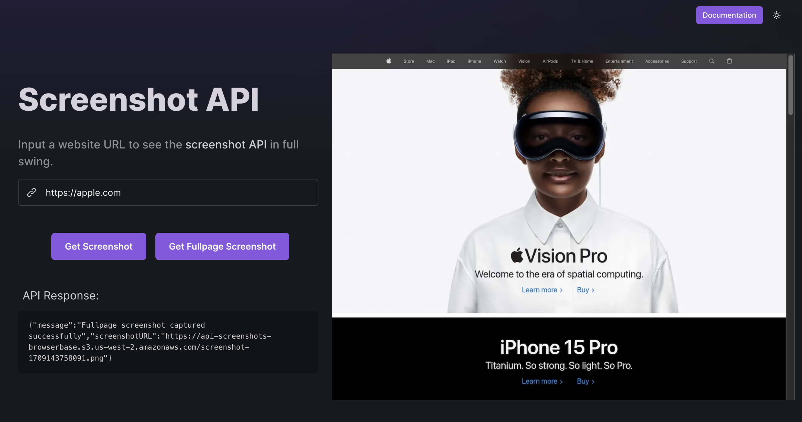

# Elliot Berdy Screenshot API

## Summary

Hi! This is a **screenshot API** that can be used to receive either a regular of full page screenshot of a given url as either a base64 encoding or as a url to a .png file stored in an AWS S3 bucket. It is in it's early stages of development still but I hope you get a chance to play around with it!

You can see a potential use case for this API at the following link: [https://browserbase-webapp.onrender.com/](https://browserbase-webapp.onrender.com/). This web app allows you to input a url and visualize either the regular or full page screenshot in the browser, as well as the API response for that given request (note: this web app is using the url endpoints of the API).

# Endpoints

There are currently four available endpoints, each corresponding to either a regular of full page screenshot that either returns a base64 encoding of the image or a link to the image.

## 1. Get regular screenshot url

> GET /v1/screenshot/url

Retrieves a url to the screenshot of the passed in url.

### Request

    https://browserbase-work-trial.onrender.com/v1/screenshot/url

**cURL Request Example**

    curl -X GET "https://browserbase-work-trial.onrender.com/v1/screenshot/url?url=https://example.com/"

**Query parameters**

**url** | string (_required_)  
Example: https://example.com/  
Url of website to take screenshot of.

### Responses

**Content Type**

> 'application/json'

| Status Code | Response                                                                                                                                                                                                                                  |
| ----------- | ----------------------------------------------------------------------------------------------------------------------------------------------------------------------------------------------------------------------------------------- |
| 200         | `{"message":"Screenshot captured successfully","screenshotURL":"https://api-screenshots-browserbase.s3.us-west-2.amazonaws.com/screenshot-1709150937398.png"}`                                                                            |
| 400         | `{"error":"URL parameter is required","example":"Example: /v1/screenshot/url?url=https://example.com"}` or `{"error":"Invalid URL format. URL must be a valid web URL.","example":"Example: /v1/screenshot/url?url=https://example.com"}` |
| 500         | `{ "error": "Error capturing screenshot. Make sure url exists." }`                                                                                                                                                                        |

**200**

    {"message":"Screenshot captured successfully","screenshotURL":"https://api-screenshots-browserbase.s3.us-west-2.amazonaws.com/screenshot-1709150937398.png"}

**400**

    {"error":"URL parameter is required","example":"Example: /v1/screenshot/url?url=https://example.com"}

or

    {"error":"Invalid URL format. URL must be a valid web URL.","example":"Example: /v1/screenshot/url?url=https://example.com"}

**500**

    { "error": "Error capturing screenshot. Make sure url exists." }

## 2. Get full page screenshot url

> GET /v1/screenshot/fullpage/url

Retrieves a url to the screenshot of the passed in url.

### Request

    https://browserbase-work-trial.onrender.com/v1/screenshot/fullpage/url

**cURL Request Example**

    curl -X GET "https://browserbase-work-trial.onrender.com/v1/screenshot/fullpage/url?url=https://example.com/"

**Query parameters**

**url** | string (_required_)  
Example: https://example.com/  
Url of website to take screenshot of.

### Responses

**Content Type**

> 'application/json'

**200**

    {"message":"Screenshot captured successfully","screenshotURL":"https://api-screenshots-browserbase.s3.us-west-2.amazonaws.com/screenshot-1709150937398.png"}

**400**

    {"error":"URL parameter is required","example":"Example: /v1/screenshot/fullpage/url?url=https://example.com"}

or

    {"error":"Invalid URL format. URL must be a valid web URL.","example":"Example: /v1/screenshot/fullpage/url?url=https://example.com"}

**500**

    { "error": "Error capturing screenshot. Make sure url exists." }

## 3. Get regular screenshot base64 encoding

> GET /v1/screenshot

Retrieves a base64 encoding of the screenshot of the passed in url.

### Request

    https://browserbase-work-trial.onrender.com/v1/screenshot

**cURL Request Example**

    curl -X GET "https://browserbase-work-trial.onrender.com/v1/screenshot?url=https://example.com/"

**Query parameters**

**url** | string (_required_)  
Example: https://example.com/  
Url of website to take screenshot of.

### Responses

**Content Type**

> 'application/json'

**200**

    {"message":"Screenshot captured successfully","screenshotData":"iVBORw0KGgoAAAANSU...kJggg=="}

**400**

    {"error":"URL parameter is required","example":"Example: /v1/screenshot?url=https://example.com"}

or

    {"error":"Invalid URL format. URL must be a valid web URL.","example":"Example: /v1/screenshot?url=https://example.com"}

**500**

    { "error": "Error capturing screenshot. Make sure url exists." }

## 4. Get full page screenshot base64 encoding

> GET /v1/screenshot/fullpage

Retrieves a base64 encoding of the full page screenshot of the passed in url.

### Request

    https://browserbase-work-trial.onrender.com/v1/screenshot/fullpage

**cURL Request Example**

    curl -X GET "https://browserbase-work-trial.onrender.com/v1/screenshot/fullpage?url=https://example.com/"

**Query parameters**

**url** | string (_required_)  
Example: https://example.com/  
Url of website to take screenshot of.

### Responses

**Content Type**

> 'application/json'

**200**

    {"message":"Full page screenshot captured successfully","screenshotData":"iVBORw0KGgoAAAANSU...kJggg=="}

**400**

    {"error":"URL parameter is required","example":"Example: /v1/screenshot/fullpage?url=https://example.com"}

or

    {"error":"Invalid URL format. URL must be a valid web URL.","example":"Example: /v1/screenshot/fullpage?url=https://example.com"}

**500**

    { "error": "Error capturing full page screenshot. Make sure url exists." }

## Shortcomings and Next Steps

### Concurrency and Scalability:

### Resource Management

### Error Handling and Logging

### Security Measures

### Lazy Loaded Images

### Web App Design
